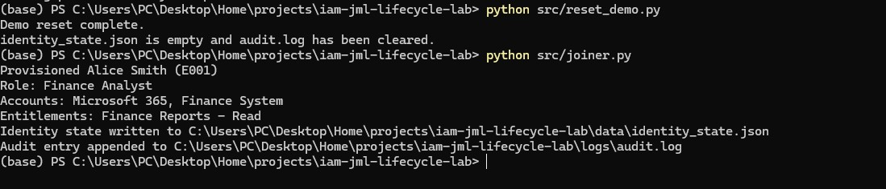
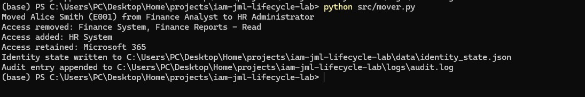
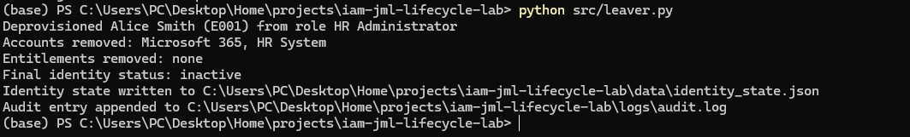
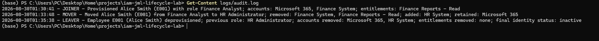
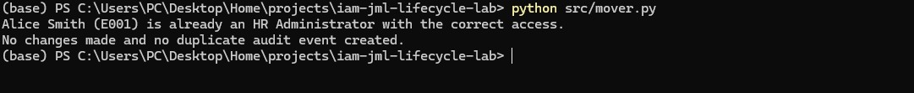

# IAM JML Lifecycle Lab

A small Python project that simulates the **Joiner-Mover-Leaver (JML)** lifecycle of one employee. It demonstrates how identity and access management (IAM) processes create access, adjust it when a role changes, and revoke it when employment ends.

It uses local JSON files instead of a real identity provider, so the lifecycle logic is easy to inspect and run.

## The IAM problem being simulated

When a person joins, changes role, or leaves an organisation, their access should change with them. Manual changes can leave people without the access they need, or with access they no longer need.

In this lab, Alice starts as a Finance Analyst, moves to HR Administrator, and then leaves the company. The scripts use role-based access data to keep her access aligned with each stage.

## Architecture


## Technologies used

- Python 3
- Python standard library (`json`, `datetime`, and `pathlib`)
- JSON for employee, role, and identity-state data
- Git and GitHub for source control and portfolio presentation

## Project structure

```text
iam-jml-lifecycle-lab/
├── data/
│   ├── employees.json          # Sample employee records
│   ├── roles.json              # RBAC role definitions
│   └── identity_state.json     # Generated identity state; clean baseline is []
├── logs/
│   └── audit.log               # Generated lifecycle audit trail (ignored by Git)
├── screenshots/
│   ├── 01-joiner.jpg           # Joiner provisioning evidence
│   ├── 02-mover.jpg            # Mover access-change evidence
│   ├── 03-mover-idempotency.jpg # Mover duplicate-protection evidence
│   ├── 04-leaver.jpg           # Leaver deprovisioning evidence
│   └── 05-audit-trail.jpg      # Complete audit-trail evidence
├── src/
│   ├── joiner.py               # Provisions Alice as a Finance Analyst
│   ├── mover.py                # Moves Alice to HR Administrator
│   ├── leaver.py               # Deprovisions Alice while retaining history
│   └── reset_demo.py           # Restores the clean demo baseline
├── .gitignore
├── README.md
└── requirements.txt
```

## Lifecycle workflows

### Joiner

`joiner.py` reads Alice (`E001`) from `employees.json`, confirms that she is active and has started, then looks up her role in `roles.json`. It creates an active identity record with the accounts and entitlements assigned to a Finance Analyst.



### Mover

`mover.py` reads Alice's current identity state and compares it with the access definition for `HR Administrator`. It retains shared access, removes Finance-only access, and adds HR access. This prevents privilege creep: Alice does not keep access merely because she once had it.



### Leaver

`leaver.py` reads Alice's current access, writes a record of what was revoked, then marks her identity inactive and removes all accounts and entitlements. Her identity record remains for audit history.



## IAM concepts demonstrated

| Concept | Where it appears in this lab |
| --- | --- |
| Identity | Alice's record in `identity_state.json` |
| Account | Application access, such as Microsoft 365 or HR System |
| Entitlement | A specific permission, such as `Finance Reports - Read` |
| RBAC | `roles.json` maps each role to its accounts and entitlements |
| Provisioning | The Joiner script creates Alice's active identity and access |
| Deprovisioning | The Leaver script revokes all access and marks the identity inactive |
| Least privilege | The Mover gives Alice only the access required for her new HR role |
| Privilege creep | The Mover removes Finance-only access after the role change |
| Auditability | Each successful lifecycle event appends a readable entry to `audit.log` |
| Idempotency | Re-running a completed workflow does not duplicate a record or audit event |

## Setup

Clone the repository, then run the scripts with Python 3. No third-party packages are required.

```bash
git clone https://github.com/Ryhanoo3/iam-jml-lifecycle-lab.git
cd iam-jml-lifecycle-lab
python --version
```

On some systems, use `python3` instead of `python`.

## Run the complete lifecycle

Run the scripts in this exact order from the repository root:

```bash
python src/reset_demo.py
python src/joiner.py
python src/mover.py
python src/leaver.py
```

The reset script starts with an empty identity state and clears the generated audit log. This makes every demonstration reproducible.

### Expected terminal output

**1. Reset**

```text
Demo reset complete.
identity_state.json is empty and audit.log has been cleared.
```

**2. Joiner**

```text
Provisioned Alice Smith (E001)
Role: Finance Analyst
Accounts: Microsoft 365, Finance System
Entitlements: Finance Reports - Read
```

**3. Mover**

```text
Moved Alice Smith (E001) from Finance Analyst to HR Administrator
Access removed: Finance System, Finance Reports - Read
Access added: HR System
Access retained: Microsoft 365
```

**4. Leaver**

```text
Deprovisioned Alice Smith (E001) from role HR Administrator
Accounts removed: Microsoft 365, HR System
Entitlements removed: none
Final identity status: inactive
```

After the final command, `data/identity_state.json` keeps Alice's historical record with `identity_status` set to `inactive` and empty access lists. `logs/audit.log` contains one JOINER, one MOVER, and one LEAVER event.



### Idempotency checks

Run any completed lifecycle script a second time to see its protection against duplicate work:

```bash
python src/leaver.py
```

Expected result:

```text
Alice Smith (E001) is already inactive with no access.
No changes made and no duplicate audit event created.
```



Use `python src/reset_demo.py` whenever you want to start the full lifecycle again.

## Limitations

This lab intentionally keeps the implementation small. It does not connect to live systems, authenticate users, process real HR events, use a database, include approvals, or handle every error condition that a production system would need. The JSON files are a learning-friendly simulation, not a secure system of record.

## Future improvements

- Provision accounts in Microsoft Entra ID and Active Directory
- Automate Windows administration with PowerShell
- Use Microsoft Graph API for account and group-management actions
- Add access reviews and certification campaigns
- Add approval workflows for sensitive access
- Validate HR source data and process multiple employees
- Add automated tests and structured logging

## License

This project is licensed under the terms in [LICENSE](LICENSE).
